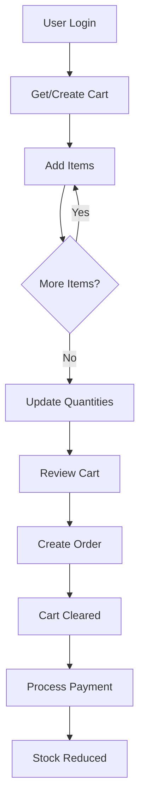

# 🛒 Shopping Cart API Endpoints

Complete documentation for the E-Commerce Shopping Cart API endpoints with full CRUD operations, stock validation, and seamless order integration.

## 📋 Table of Contents

- [Overview](#overview)
- [Authentication](#authentication)
- [Endpoints](#endpoints)
- [Usage Examples](#usage-examples)
- [Error Handling](#error-handling)
- [Integration Flow](#integration-flow)

## 🌟 Overview

The Shopping Cart API provides complete cart management functionality including:

- **Cart Creation**: Automatic cart creation on first access
- **Item Management**: Add, update, and remove items
- **Stock Validation**: Real-time stock checking
- **Price Calculation**: Automatic total calculation
- **Order Integration**: Seamless cart-to-order conversion

### Key Features
- ✅ **Auto-Creation**: Cart automatically created for users
- ✅ **Stock Validation**: Prevents overselling
- ✅ **Quantity Updates**: Flexible item quantity management
- ✅ **Real-time Totals**: Automatic price calculations
- ✅ **User Isolation**: Each user has their own cart

## 🔐 Authentication

All cart endpoints require JWT authentication:

```http
Authorization: Bearer YOUR_JWT_TOKEN
```

Get your token by logging in:
```bash
curl -X POST "http://localhost:8000/auth/login" \
  -H "Content-Type: application/json" \
  -d '{"username": "your_username", "password": "your_password"}'
```

## 📡 Endpoints

### 1. Get Cart Contents
Retrieve the current user's shopping cart with all items and totals.

```http
GET /cart
```

**Response:**
```json
{
  "cart_id": 1,
  "items": [
    {
      "cart_item_id": 1,
      "product_id": 2,
      "product_name": "Test Product for Cart",
      "price": 49.99,
      "quantity": 3,
      "total": 149.97
    }
  ],
  "total_amount": 149.97
}
```

**Features:**
- Auto-creates cart if doesn't exist
- Returns empty cart for new users
- Calculates totals automatically

---

### 2. Add Item to Cart
Add a new item to the cart or increase quantity of existing item.

```http
POST /cart/items
```

**Request Body:**
```json
{
  "product_id": 2,
  "quantity": 3
}
```

**Response:**
```json
{
  "message": "Item added to cart successfully"
}
```

**Behavior:**
- If item exists: Adds to existing quantity
- If new item: Creates new cart item
- Validates product exists
- No stock validation at add time (validated at checkout)

---

### 3. Update Item Quantity ✨
Update the quantity of an existing cart item with stock validation.

```http
PUT /cart/items/{cart_item_id}
```

**Request Body:**
```json
{
  "quantity": 5
}
```

**Response:**
```json
{
  "message": "Cart item quantity updated successfully"
}
```

**Features:**
- ✅ **Stock Validation**: Checks available stock before update
- ✅ **User Verification**: Ensures user owns the cart item
- ✅ **Real-time Validation**: Prevents overselling

**Error Cases:**
- `400`: Quantity must be greater than 0
- `400`: Insufficient stock available
- `404`: Cart item not found or doesn't belong to user

---

### 4. Remove Item from Cart
Remove a specific item completely from the cart.

```http
DELETE /cart/items/{cart_item_id}
```

**Response:**
```json
{
  "message": "Item removed from cart successfully"
}
```

**Features:**
- Removes item completely (not just reducing quantity)
- Validates user owns the cart item
- Updates cart totals automatically

---

## 💡 Usage Examples

### Complete Shopping Flow

#### 1. Start Shopping - Get Cart
```bash
curl -X GET "http://localhost:8000/cart" \
  -H "Authorization: Bearer YOUR_TOKEN"
```

#### 2. Add Items to Cart
```bash
# Add laptop to cart
curl -X POST "http://localhost:8000/cart/items" \
  -H "Authorization: Bearer YOUR_TOKEN" \
  -H "Content-Type: application/json" \
  -d '{"product_id": 1, "quantity": 2}'

# Add phone to cart
curl -X POST "http://localhost:8000/cart/items" \
  -H "Authorization: Bearer YOUR_TOKEN" \
  -H "Content-Type: application/json" \
  -d '{"product_id": 2, "quantity": 1}'
```

#### 3. Update Item Quantity
```bash
# Change laptop quantity to 3
curl -X PUT "http://localhost:8000/cart/items/1" \
  -H "Authorization: Bearer YOUR_TOKEN" \
  -H "Content-Type: application/json" \
  -d '{"quantity": 3}'
```

#### 4. Review Cart
```bash
curl -X GET "http://localhost:8000/cart" \
  -H "Authorization: Bearer YOUR_TOKEN"
```

#### 5. Remove Item
```bash
# Remove phone from cart
curl -X DELETE "http://localhost:8000/cart/items/2" \
  -H "Authorization: Bearer YOUR_TOKEN"
```

#### 6. Proceed to Checkout
```bash
# Create order from cart
curl -X POST "http://localhost:8000/orders" \
  -H "Authorization: Bearer YOUR_TOKEN"
```

### Advanced Examples

#### Check Stock Before Large Quantity Update
```bash
# First check product stock
curl -X GET "http://localhost:8000/products/1"

# Then update if stock is sufficient
curl -X PUT "http://localhost:8000/cart/items/1" \
  -H "Authorization: Bearer YOUR_TOKEN" \
  -H "Content-Type: application/json" \
  -d '{"quantity": 10}'
```

#### Batch Add Multiple Items
```bash
#!/bin/bash
TOKEN="YOUR_JWT_TOKEN"

# Add multiple items in sequence
products=(
  '{"product_id": 1, "quantity": 2}'
  '{"product_id": 2, "quantity": 1}'
  '{"product_id": 3, "quantity": 3}'
)

for product in "${products[@]}"; do
  curl -X POST "http://localhost:8000/cart/items" \
    -H "Authorization: Bearer $TOKEN" \
    -H "Content-Type: application/json" \
    -d "$product"
done
```

## ⚠️ Error Handling

### Common Error Responses

#### 401 Unauthorized
```json
{
  "detail": "Invalid token"
}
```
**Solution**: Login again to get a new token

#### 400 Bad Request - Invalid Quantity
```json
{
  "detail": "Quantity must be greater than 0"
}
```
**Solution**: Use positive integers for quantity

#### 400 Bad Request - Insufficient Stock
```json
{
  "detail": "Insufficient stock. Available: 5"
}
```
**Solution**: Reduce quantity or check product availability

#### 404 Not Found - Cart Item
```json
{
  "detail": "Cart item not found"
}
```
**Solution**: Verify cart_item_id belongs to your cart

#### 500 Internal Server Error
```json
{
  "detail": "Database connection error"
}
```
**Solution**: Contact support or try again later

### Error Handling Best Practices

```javascript
// JavaScript example with error handling
async function updateCartItem(cartItemId, quantity) {
  try {
    const response = await fetch(`/cart/items/${cartItemId}`, {
      method: 'PUT',
      headers: {
        'Authorization': `Bearer ${token}`,
        'Content-Type': 'application/json'
      },
      body: JSON.stringify({ quantity })
    });
    
    if (!response.ok) {
      const error = await response.json();
      
      switch (response.status) {
        case 400:
          if (error.detail.includes('Insufficient stock')) {
            alert(`Sorry! Only ${error.detail.split(': ')[1]} items available`);
          } else {
            alert('Invalid quantity. Please enter a positive number.');
          }
          break;
        case 404:
          alert('Item not found in your cart.');
          break;
        default:
          alert('Something went wrong. Please try again.');
      }
      return false;
    }
    
    const result = await response.json();
    console.log(result.message);
    return true;
    
  } catch (error) {
    console.error('Network error:', error);
    alert('Network error. Please check your connection.');
    return false;
  }
}
```

## 🔄 Integration Flow

### Cart-to-Order Workflow



### Stock Validation Points

1. **Add to Cart**: No stock validation (for better UX)
2. **Update Quantity**: Real-time stock validation
3. **Order Creation**: Final stock validation
4. **Payment Processing**: Stock reduction occurs

### Database Relationships

```sql
-- Cart belongs to User
Cart.UserID → Users.UserID

-- CartItems belong to Cart and reference Products
CartItems.CartID → Cart.CartID
CartItems.ProductID → Products.ProductID

-- Orders created from Cart
Orders.UserID → Users.UserID
OrderItems.ProductID → Products.ProductID
```

## 🧪 Testing Your Implementation

### Quick Test Script
```bash
#!/bin/bash
# Test cart functionality

BASE_URL="http://localhost:8000"
TOKEN="YOUR_JWT_TOKEN"

echo "🧪 Testing Cart Functionality..."

# 1. Get empty cart
echo "1️⃣ Getting cart..."
curl -s -X GET "$BASE_URL/cart" -H "Authorization: Bearer $TOKEN" | jq

# 2. Add item
echo "2️⃣ Adding item..."
curl -s -X POST "$BASE_URL/cart/items" \
  -H "Authorization: Bearer $TOKEN" \
  -H "Content-Type: application/json" \
  -d '{"product_id": 1, "quantity": 2}' | jq

# 3. View cart
echo "3️⃣ Viewing cart..."
curl -s -X GET "$BASE_URL/cart" -H "Authorization: Bearer $TOKEN" | jq

# 4. Update quantity
echo "4️⃣ Updating quantity..."
curl -s -X PUT "$BASE_URL/cart/items/1" \
  -H "Authorization: Bearer $TOKEN" \
  -H "Content-Type: application/json" \
  -d '{"quantity": 5}' | jq

# 5. Final cart check
echo "5️⃣ Final cart..."
curl -s -X GET "$BASE_URL/cart" -H "Authorization: Bearer $TOKEN" | jq
```

## 📊 Performance Considerations

### Optimization Tips

1. **Cart Caching**: Consider Redis for high-traffic scenarios
2. **Stock Checks**: Batch stock validation for multiple items
3. **Database Indexing**: Ensure proper indexes on CartItems queries
4. **Connection Pooling**: Use connection pooling for better performance

### Recommended Indexes
```sql
-- Optimize cart queries
CREATE INDEX IX_Cart_UserID ON Cart(UserID);
CREATE INDEX IX_CartItems_CartID ON CartItems(CartID);
CREATE INDEX IX_CartItems_ProductID ON CartItems(ProductID);
```

## 🔒 Security Features

- ✅ **User Isolation**: Users can only access their own cart
- ✅ **JWT Authentication**: Secure token-based auth
- ✅ **Input Validation**: All inputs validated
- ✅ **SQL Injection Protection**: Parameterized queries
- ✅ **Authorization Checks**: User ownership verification

## 🚀 Future Enhancements

### Possible Improvements
- **Cart Expiration**: Auto-clear old carts
- **Save for Later**: Wishlist functionality  
- **Bulk Operations**: Add/remove multiple items at once
- **Cart Sharing**: Share cart with other users
- **Price Tracking**: Historical price monitoring
- **Recommendations**: Suggest related products

---

## 📞 Support

For issues or questions about the Cart API:
- Check error messages for specific guidance
- Verify authentication tokens are valid
- Ensure product IDs exist before adding to cart
- Contact support for persistent issues

**Happy Shopping! 🛒✨** 